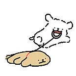
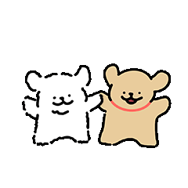
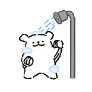
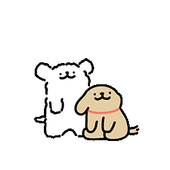

<p align="right">
  <a href="README.md">中文</a> |
  <a href="README.en.md">English</a>
</p>

<h1 align="center">Line Dog Desktop Pet</h1>

<p align="center">
  一只轻量的 PySide6 桌面小狗，支持透明悬浮、互动动画、属性状态、工作模式、托盘控制和退出告别动画。
</p>

<p align="center">
  <a href="https://github.com/ZYC99/line-dog-desktop-pet/releases/latest">下载最新版</a>
  ·
  <a href="assets/gif/README.md">查看素材说明</a>
  ·
  <a href="docs/README.md">项目文档</a>
</p>

## 主要功能

- 桌面透明悬浮小狗，默认置顶显示，可通过托盘显示/隐藏。
- 右键互动菜单：喂食、洗澡、打招呼、玩耍、打工模式、尺寸调整。
- 属性状态：饱食度、清洁度、好感度会随时间变化。
- 心情与状态动画：待机、走路、开心、生气、饿了、脏了、睡觉等。
- 工作模式：缩小到 135px，锁定工作动画，降低桌面干扰。
- 退出告别动画：关闭应用前播放 `bye` 动画，再保存状态并退出。
- GitHub Actions 自动构建 Release，并上传带小狗图标的 `LineDogPet.exe`。

## 动作预览

GIF 可以直接在 GitHub README 中播放。下面只展示代表动作，完整素材清单见 [GIF 资源说明](assets/gif/README.md)。

| 待机 | 走路 | 拖拽 | 打招呼 |
|------|------|------|--------|
|  |  |  |  |

| 喂食 | 洗澡 | 玩耍 | 开心 |
|------|------|------|------|
|  |  |  |  |

| 睡觉 | 打工 | 告别 | 震惊 |
|------|------|------|------|
|  |  |  |  |

## 快速开始

普通用户可以直接从 [Releases](https://github.com/ZYC99/line-dog-desktop-pet/releases/latest) 下载 `LineDogPet.exe`。

开发运行：

```powershell
.\.venv\Scripts\python.exe main.py
```

## 验证

```powershell
$env:QT_QPA_PLATFORM='offscreen'; .\.venv\Scripts\python.exe -m unittest test_regressions.py
.\.venv\Scripts\python.exe -m py_compile main.py config.py pet_stats.py pet_animation.py pet_menu.py pet_window.py test_regressions.py
git diff --check
```

## 打包

本地维护者可以使用：

```powershell
.\build.bat
```

Release 构建由 GitHub Actions 负责。推送 `v*` 标签后，工作流会安装依赖、运行测试、执行 PyInstaller，并上传带小狗图标的 `LineDogPet.exe` 到 GitHub Release。

## 文档

- [项目文档索引](docs/README.md)
- [代码编写规范](CLAUDE.md)
- [GIF 资源说明](assets/gif/README.md)
- [English README](README.en.md)
